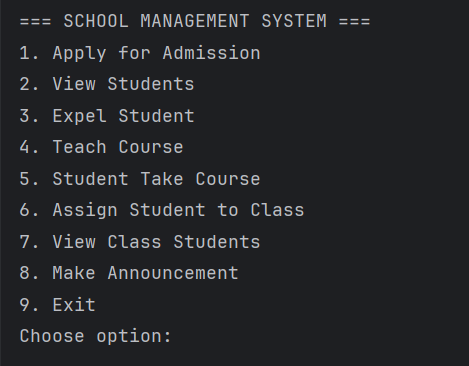

## SCHOOL MANAGEMENT SYSTEM

- A console-based School Management System built using Object-Oriented Programming (OOP) principles in Java.

This project models a basic school structure including staff roles, students, applicants, courses, and classes.

# Features
- Applicant admission (age-based validation)
- Student management 
- Student expulsion (by Principal)
- Teacher teaches courses 
- Students take courses 
- Non-academic staff assigns students to classes & make announcement 
- School-wide announcements 
- Interactive menu-driven console system

# Learning Objective

This project was built to practice and demonstrate mastery of:

- Java OOP design 
- Class relationships
- Clean architecture structure
- Console-based interaction logic
- Real-world system modeling

# Project Structure
- Core Abstractions 
  - Person (Abstract)
  - Staff (Abstract)

- Roles 
  - Principal 
  - Teacher 
  - NonAcademicStaff 
  - Student 
  - Applicant

- Supporting Models 
  - Course 
  - SchoolClass 
  - Entry Point
  - Main (Interactive Console Application)

## OOP Concepts Applied

- Encapsulation → Private fields with getters 
- Inheritance → Staff & Student inherit from Person 
- Abstraction → Abstract base classes 
- Polymorphism → Role-based behavior 
- Aggregation → Student–Course relationship 
- Composition → SchoolClass contains Students 
- Single Responsibility Principle

# How to Run?
- Clone the Repo: Using 
    git clone https://github.com/Bemmanuel01/School-Management-System-App

- Open in IntelliJ or any Java IDE
- Run the code: 
    "Main.java"

# Sampled Output of the Menu

# Author
Benjamin Emmanuel

